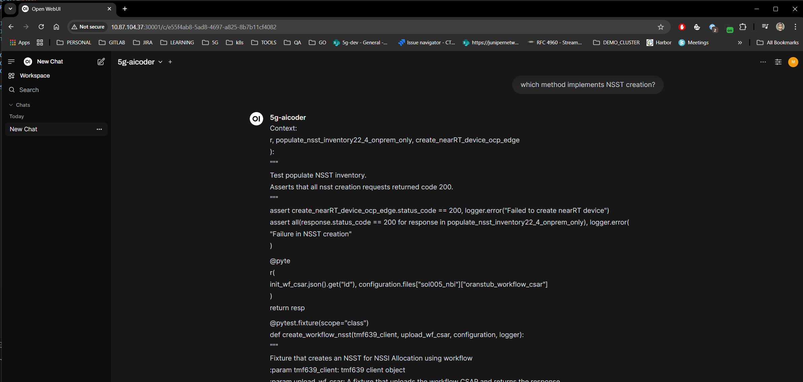

# Aicoder


## Local Debugging/Testing
```
sudo rm -rf .venv
./debug.sh
```

## Launch open-webui to use it as a frontend chatbot
```
git clone https://github.com/open-webui/open-webui.git
cd open-webui
docker rm -f open-webui && docker run -d -p 30001:8080 -e OPENAI_API_KEY=ef19e6b7-d8e3-4a76-91c0-be50029dd332 -v open-webui:/app/backend/data --name open-webui --restart always ghcr.io/open-webui/open-webui:main

```
Open browser in port 30001 and then:
1. create an account
2. user > settings > admin settings > connections > OpenAI API > API KEY: ef19e6b7-d8e3-4a76-91c0-be50029dd332, API URL: http://10.87.104.37:30081/v1
3. You should be able to see something like this:



## Docker Building
```
./dockerprepare.sh local
```

## Docker Running
if there are local firewall rules you need to give access to in/out docker traffic:
```
sudo ufw allow in on docker0
sudo systemctl restart docker
sudo ufw allow 9443/tcp
sudo ufw allow 8080/tcp
```

```
./dockerrun.sh start
docker logs -f aicoder
docker stats
```

## Docker Stop
```
./dockerrun.sh stop
```

## Architecture

```
pip install diagrams
sudo apt install graphviz
pyreverse -o png -p server app
```

## Roadmap
- [.] Quick n Dirty MVP code
- [ ] Pre-commit hooks
- [ ] Github actions to enable pre-commit hooks pipelines
- [ ] OOP code
- [ ] Pytest unit tests
- [ ] Pytest integration tests
- [.] Docker implementation
- [ ] Auto deployment to the cloud
